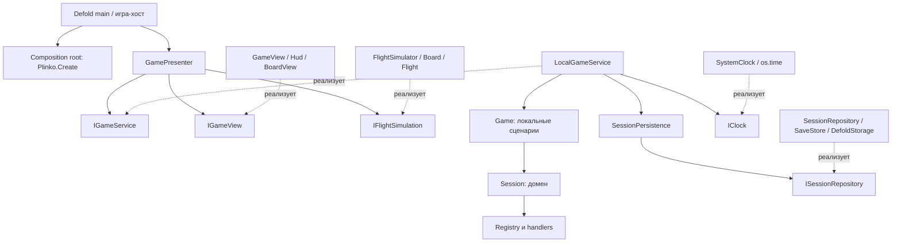

# Архитектура Plinko Lab

Разработчик: **IDDLEX**. Проект организован как встраиваемый игровой модуль: **Passive View MVP**, игровой сервис за контрактом, чистый домен и адаптеры инфраструктуры. Рабочая реализация выполняет расчёты локально. Сетевой сервис и сервер не создавались.

## Слои и зависимости

Сплошная стрелка — зависимость/вызов; пунктир — реализация интерфейса. Bootstrap связывает конкретные объекты. Presenter получает уже собранные порты и не импортирует LocalGameService, Session, SaveStore, GUI или часы.

| Каталог | Ответственность и разрешённые зависимости |
| --- | --- |
| `scripts/contracts/` | Интерфейсы, аннотации и проверка обязательных методов; без движка и реализации игры. |
| `scripts/domain/` | Данные и инварианты Session, валидация конфига, RNG и расширяемые награды. Не знает сервисов, GUI и хранения. |
| `scripts/application/` | LocalGameService, локальные сценарии Game и координатор SessionPersistence. Знает domain/contracts; получает часы и repository. |
| `scripts/presentation/` | MVP Presenter: намерения, события, состояние экрана, lifecycle визуального полёта. Знает только contracts. |
| `scripts/infrastructure/` | Реализации портов часов/хранилища и формат двух локальных save-слотов. |
| `scripts/simulation/` | Визуальная баллистика выбранного исхода; не начисляет награды. |
| `scripts/ui/` | Пассивное Defold-представление, GUI, mesh, звуки, форматирование, hit testing. |
| `scripts/bootstrap/` | Composition root: выбор реализаций и владение их графом. |
| `main/` | Адаптер входных событий Defold и ресурсы самостоятельного запуска. |

`tools/check-layers.ps1` проверяет направления импортов и отсутствие обращений к engine/system API в чистых слоях. Simulation может использовать числовой RNG, UI — копирование доменных value data; запуск обработчиков наград из UI запрещён.

## Почему Passive View MVP

У игры один небольшой экран и много императивной анимации: создать шар, передвинуть, подсветить кеглю, показать выдачу. Defold GUI не предоставляет готовую систему привязок данных уровня MVVM. Здесь MVVM потребовал бы собственных observable/property binding механизмов, не упрощающих этот сценарий.

View рисует переданные данные и сообщает семантические намерения. Presenter решает, какую команду отправить, когда создать/освободить полёт, переключить статистику и воспроизвести эффект. Он не форматирует строки, не знает узлов GUI и не рассчитывает экономику. Модель — состояние и результаты выбранного IGameService, а не ссылка View на Session.

Тест Presenter использует обычный Lua-объект вместо View и настоящий FlightSimulator. Для проверки ожидания тест вручную выдаёт события порта на следующих шагах; production-транспорт для этого не создаётся.

## Интерфейсы и композиция

Lua-интерфейс — структурный контракт методов, результатов и lifecycle. В `contracts/ports.lua` есть IClock, ISessionRepository, IGameView, IFlightSimulation; в `contracts/game_service.lua` — IGameService, GameCommand, GameState и GameEvent. `Ports.Require` проверяет обязательные методы при создании графа. Аннотации полезны IDE; поведение проверяют тесты.

Объекты портов используют `service:Execute(...)`, то есть передают self. Чистые доменные модули сохраняют явный стиль `Session.Drop(session, count, now)`. Это разные способы записи вызова, а не разница в уровне абстракции. Нет глобального контейнера, скрытого поиска сервисов или обязательного наследования от пустых классов.

`Plinko.Create(parent, options)` создаёт LocalGameService по умолчанию. При `options.Service` локальный граф вообще не создаётся: не читаются save-слоты, не используется локальный RNG и не проверяется локальный config. В этой точке подключается будущий backend-сервис; экран продолжает работать через IGameService.

Полные сигнатуры, DTO, события, правила повторов и пример интеграции находятся в [SERVICE_CONTRACT.md](SERVICE_CONTRACT.md).

## Владение и жизненный цикл

- Main или хост владеет Presenter и передаёт Start, Update, Activate, SetFocus, Flush и Dispose.
- Presenter владеет своим Service/View/Simulation, списком полётов, флагами фокуса, статистики и звука. У него нет Session и save payload.
- LocalGameService замыкает Game, SessionPersistence, clock, фазу и очередь результатов. SessionPersistence владеет repository, незавершённой операцией и очередью callbacks. Наружу выдаёт копии данных.
- Game владеет Session, очередью Started/Awarded, поколениями состояния и ожидающими выплатами; у него нет ссылки на хранилище.
- Session владеет RNG, остатками, pending и агрегатами. Registry передан явно и не является полем конфигурации.
- GameView владеет GUI-root, visual по ID, нажатием кнопки и board renderer. При Dispose отменяет ввод, освобождает renderer и удаляет своё дерево GUI.

Open может завершиться сразу или позже. До Ready View показывает загрузку, а Presenter не отправляет игровые команды. Ready приходит один раз, задаёт конфигурацию экрана и предшествует Started. При Busy новые команды временно недоступны; число ранее подтверждённых полётов не ограничивается.

Потеря фокуса отменяет нажатие и останавливает только визуальную симуляцию; сервис получает Suspend. На возврате Resume обновляет экономическое состояние. При закрытии Presenter сначала прекращает обработку событий, затем освобождает сервис и представление. Dispose повторно безопасен. SessionPersistence уже игнорирует поздние callbacks repository после Dispose. Для закрытия с подтверждённым прогрессом хост ожидает Presenter.Flush; уничтожение процесса само по себе не ждёт сеть.

## Один бросок

1. Defold переводит Space или отпускание кнопки в намерение Drop. Main передаёт его Presenter.
2. Presenter отправляет `Execute({Kind = "Drop", Count = 1})`. Он не считает сам остаток, RNG, корзину или награду и не трактует возврат как успех.
3. LocalGameService получает время через IClock и вызывает Game.Drop. Session сначала проверяет всю серию, затем резервирует запас и исходы.
4. Для каждого шара сохраняются уникальный ID, стабильный BasketId, копия Rewards с версиями и Seed визуального маршрута.
5. Game создаёт checkpoint с поколением состояния. LocalGameService передаёт его SessionPersistence, который вызывает асинхронный repository. Started публикуется только после успешной записи дебета и исходов. При ошибке право остаётся в памяти, запись повторяется, новая серия не принимается.
6. Presenter получает Started, создаёт полёт через IFlightSimulation и просит View создать visual. Ни UI, ни Flight не могут изменить authoritative Rewards.
7. Flight доходит до корзины. Presenter удаляет visual и сообщает сервису Landed(id). Game вызывает Session.Land: стадия меняется на Landed, попадание учитывается один раз. Затем вызывается Session.Complete.
8. Registry применяет пакет в изолированные состояния. Полный успех закрывает pending, меняет баланс и увеличивает SettledCount; отказ оставляет выплату ожидающей. Попадание уже учтено и не зависит от результата Apply.
9. Awarded сообщает результат Presenter. Он показывает эффект/текст. Промежуточные приземления объединяются в checkpoint с интервалом до 250 мс после последнего подтверждения. Последняя выплата, Drop/Grant и lifecycle-запросы не ждут этого интервала. Авария в окне объединения восстанавливает прежние оплаченные исходы из согласованного snapshot.

Если другой сервис подтвердит выплату раньше полёта, Presenter отложит только эффект корзины. Полученная модель баланса остаётся авторитетной. Если результат пришёл позже, visual уже удалён и не удерживается ради ожидания.

## Домен и конфигурация

`config/game.lua` — дизайнерские данные. Config.Validate проверяет целые лимиты, конечные веса, плотный список 2–16 корзин, стабильные уникальные ID, цвет, сумму вероятностей и пакеты наград. Возвращаемая конфигурация содержит только сериализуемые данные. Ссылка на Registry передаётся отдельным параметром в Session/Game/SaveStore.

Основные сигнатуры: `Session.New(config, now, saved, registry)`, `Session.ValidateSnapshot(config, raw, registry)`, `Session.View(session, includeDetails)`. View теперь чистая проекция: не принимает время и не начисляет refill. Время двигают команды, Advance и Update сервиса.

Session связывает каждый дебет с pending ID. Каждый pending имеет фазу InFlight или Landed. Инварианты `SettledCount + #Pending + 1 == NextDropId` и `TotalHits == SettledCount + число Landed в Pending` проверяются при восстановлении; сумма попаданий текущих и архивных корзин соответствует TotalHits. Число ожидающих выплат также не может превышать попадания соответствующей корзины. InFlightCount и PendingRewardCount доступны в проекции отдельно; ActiveCount сохраняет смысл всех незавершённых бросков. ID → позиция и swap removal дают O(1) поиска/удаления pending, но не всей операции выдачи.

Weights управляют вероятностями. Park–Miller хранится в Session; выбор исхода и seed не зависят от кадров и эффектов. Refill использует абсолютный deadline, применяется за офлайн-период без цикла по секундам и останавливается на cap. Ручная выдача ограничена MaxInventory, а не refill cap. Откат часов сохраняет оставшуюся задержку; локальные часы не защищают от намеренной подмены времени.

## Награды

Пакет корзины — список `{Type, ...}`. Registry вызывает Normalize, NewState, ValidateState, Apply и опциональные правила зарегистрированного обработчика. Points, balls и item реализованы отдельно. Повторяющиеся Type в одном пакете последовательно работают с одним draft.

Registry глубоко копирует только затронутые пространства и публикует новое RewardState после успеха всех обработчиков и проверки результата. Отказ или исключение отбрасывает весь draft. Session закрывает pending только после успешной выдачи. Внешние HTTP/платформенные операции внутри Apply запрещены: локальная копия не может их откатить.

Добавление вида награды требует handler и formatter плюс регистрацию. Session.Complete, Presenter и HUD не получают switch по новому Type. Points и balls остаются понятиями конкретной Plinko-экономики: заменить тип награды и полностью изменить цену/валюту игры — разные задачи.

В локальном варианте Awarded означает применённую выплату в памяти; постоянная запись подтверждается отдельным checkpoint. Восстановление старого согласованного checkpoint повторяет выдачу в старое состояние, а не поверх уже выплаченного баланса. Контракт обработчика и пример unlock: [REWARDS.md](REWARDS.md).

## Хранение и ошибки

ISessionRepository — асинхронная граница источника сохранений. Load/Save получают request и callback; результат содержит Status и непрозрачную Revision. SessionPersistence последовательно отправляет снимки, повторяет тот же Id/payload, проверяет ответы и обрабатывает таймауты. При конфликте запись останавливается. Локальный SessionRepository завершает callback сразу, удалённый может позже: приложение использует один путь. Подмена options.Repository сохраняет локальную экономику; options.Service нужен для замены самой экономики. Полный контракт: [PERSISTENCE_CONTRACT.md](PERSISTENCE_CONTRACT.md).

SaveStore сохраняет v3 snapshot в двух чередующихся слотах с возрастающей ревизией. DefoldStorage читает байты через io.open/read и декодирует через sys.deserialize: отсутствие файла, недоступность I/O и повреждение содержимого различаются. Недоступность любого слота блокирует запись до нового успешного открытия сессии, даже если другой слот исправен. Читаемый, но повреждённый последний слот допускает откат к предыдущему валидному. Если валидных слотов нет при наличии ошибок, новая игра не создаётся. Неизвестная версия envelope/snapshot/handler блокирует перезапись даже при старом совместимом слоте. Это локальное восстановление, а не ACID или гарантия fsync.

Оплаченный исход сохраняется до анимации. По перезапуску InFlight воспроизводится с теми же ID/BasketId/Rewards/Seed. Landed не анимируется повторно: сервис восстанавливает только попытки выплаты. Изменения конфига сопоставляются по стабильным ID; удалённые корзины архивируются, их pending начисляются без невозможной анимации. Понижение MaxInventory не уничтожает уже принадлежащий запас или обещания.

Ошибка Apply оставляет pending для повторной попытки раз в секунду. При сбое записи принятой команды сервис выдаёт CommandStatus(Pending) с ID и Busy=true. После успешного checkpoint тот же ID получает Succeeded ровно один раз; повторного списания, Grant или RNG нет. Rejected означает отсутствие принятого действия. Ошибка записи блокирует новые дебеты; успешные ранее записанные полёты могут завершаться. Ни Presenter, ни View не выполняют экономический retry самостоятельно. Подтверждение старого snapshot не очищает более новые изменения: Game.Confirm учитывает Generation, а последующее состояние отправляется следующим snapshot. Одновременно выполняется одна логическая операция записи.

## Симуляция и представление

Board строит N корзин и N−1 рядов кеглей. Flight строит баллистические сегменты до выбранной корзины: x=x0+vx*t, y=y0+vy*t−g*t²/2. Направления контактов согласованы с исходом; собственный RNG маршрута используется только при создании. Большой dt проходит все пересечённые контакты. Это управляемая баллистика, без Box2D и взаимодействия шаров между собой.

Статическое поле — GUI. Активные шары — Lua-данные и mesh: 24 вершины на шар. Буфер растёт до ближайшей степени двойки; при заполнении не более четверти ёмкости уменьшается, минимум — 32 шара. Пустое поле возвращает минимальный буфер даже под панелью статистики. Кэш освобождённых визуальных объектов ограничен 32 записями. Dispose очищает mesh и Lua-ссылки независимо от ошибки отключения компонента. Искусственного лимита активных шаров нет. Flush пропускает неизменившиеся кадры и скрытую доску, освобождённые слоты прозрачны. Числа FPS требуют измерений на целевом устройстве.

View форматирует строки через Strings/RewardText. Русские подписи используют Noto Sans; в debug числовые ячейки статистики рисуются draw_debug_text, в release — GUI. Количество узлов не растёт с числом шаров. Муравьиное оформление IDDLEX, звук и эффекты не вмешиваются в игровые исходы.

## Встраивание и дальнейшее развитие

Хост может заменить Service, View, Simulation, Clock или Repository в точке сборки. Для самостоятельных локальных экземпляров задаются разные StorageNamespace. Для нескольких видимых досок передаются отдельные MeshUrl и BufferResource через options.Render. Хост включает нужные Defold-ресурсы и render predicates либо предоставляет своё представление.

Бэкенд-реализация IGameService будет владеть транспортом, преобразованием DTO, серверным временем, идемпотентными идентификаторами запросов, повторами и восстановлением. Она не должна доверять клиентскому Landed как основанию выплаты. Эти обязанности описаны контрактом; их реальная реализация зависит от backend. В текущем проекте нет сетевых endpoints, mock-сервера или обещания распределённой exactly-once выдачи.

Структура допускает такое развитие без переписывания Presenter, HUD и траекторий. Другие изменения имеют свою область: новая экономика затронет домен/сервис, большой инвентарь — отдельное представление, другой движок — IGameView и host adapter. Гибкость обеспечена в названных границах, а не обещанием заменить любую механику одним конфигом.

## Проверка

Проверки включают 108 Lua-спецификаций, четыре сценария настоящего headless Defold, три проверки файловых блокировок и production WebGL debug/release. Дополнительный режим tools/run-tests.ps1 -Profile измеряет настоящий Presenter/GUI/mesh/локальные файлы при обычной и стресс-нагрузке; GPU и полный engine frame в него не входят.

Команды проверки: [README](../README.md#проверки). Контракты для расширения и интеграции: [SERVICE_CONTRACT.md](SERVICE_CONTRACT.md).
