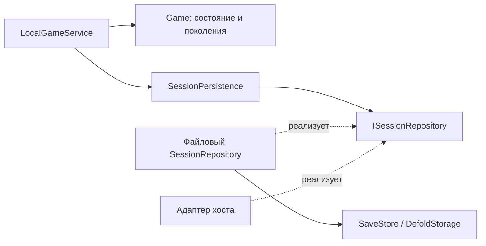

# Заменяемый источник сохранений

Разработчик: **IDDLEX**. Асинхронный контракт сохранения игровой сессии.

**Для замены локальных файлов серверным, облачным или другим хранилищем передайте другую реализацию `ISessionRepository` в `options.Repository`. LocalGameService, Game, домен, Presenter, View и симуляцию переписывать не требуется.** В рабочем проекте реализован файловый адаптер; сетевого транспорта и mock-сервера нет. Отложенная реализация существует только как управляемая тестовая фикстура.

Если нужно перенести на сервер также расчёт исходов и экономику, это другая граница — `options.Service` / `IGameService`. Серверное хранение локального состояния само по себе не делает клиентскую экономику доверенной.

## Подключение

```lua
local presenter, view = Plinko.Create(gui.get_node("root"), {
    Repository = host.PlinkoSaveRepository,
    Persistence = {TimeoutSeconds = 15, RetrySeconds = 1},
})
Presenter.Start(presenter)
```

`host.PlinkoSaveRepository` — объект, созданный игрой-хостом. Он реализует контракт ниже и владеет деталями своего источника: аккаунтом/namespace, адресом, транспортом, форматом хранения и токенами доступа. Без `Repository` composition root создаёт существующий `SessionRepository → SaveStore → DefoldStorage`. Параметры `Storage` и `StorageNamespace` применяются только при создании этого файлового адаптера.

У каждого экземпляра игры должен быть собственный экземпляр repository. LocalGameService владеет им до Dispose; повторно использовать уничтоженный объект нельзя. Для локальных файлов один namespace обслуживает один владелец. Поддержка нескольких устройств и конкурирующих писателей обеспечивается конкретным удалённым адаптером и хранилищем.

## Структурный интерфейс Lua

Типы `ISessionRepository`, `RepositoryLoadRequest`, `RepositorySaveRequest`, `RepositoryResult` объявлены в `scripts/contracts/ports.lua`. Методы вызываются через двоеточие:

```lua
repository:Load({Id = 1}, completed)
repository:Save({Id = 2, Snapshot = snapshot, ExpectedRevision = revision}, completed)
repository:Dispose()
```

Load/Save не возвращают результат операции. Адаптер вызывает `completed(result)` сразу или позднее. Результат callback должен быть plain data, без функций, userdata, metatable и циклов. Вызов происходит на потоке владельца; repository с фоновыми потоками обязан сам доставить callback на этот поток. Возвращаемое значение метода игнорируется.

| Result | Значение |
| --- | --- |
| `{Status="ok", Snapshot=..., Revision=..., Warning=...}` | Успешная загрузка. Snapshot=nil **только если сохранения действительно нет**. Revision обязателен и для новой игры. Warning необязателен. |
| `{Status="ok", Revision=...}` | Запись подтверждена на выбранном уровне хранения. Простая постановка сетевого запроса в очередь не считается успехом. |
| `{Status="retry", Error="..."}` | Временный отказ или неизвестный исход; приложение повторит ту же логическую операцию. |
| `{Status="failed", Error="..."}` | Постоянный отказ, нарушение формата/доступа или иная причина прекратить работу с этим состоянием. |
| `{Status="conflict", Error="..."}` | ExpectedRevision устарела; автоматически перезаписывать чужое состояние нельзя. |

Revision — непрозрачная непустая строка или неотрицательное точное целое. Это может быть версия записи или ETag. Приложение не увеличивает её и не разбирает содержимое: передаёт полученный токен в следующий Save. Файловый адаптер использует ревизию SaveStore, начиная с 0 для новой игры.

Ошибка чтения не должна превращаться в `ok` с Snapshot=nil. Неизвестная/несовместимая схема должна завершаться `failed`. Snapshot v3 валидируется доменом до начала игры независимо от источника; конвертация внешнего формата в этот snapshot — обязанность адаптера. Изменение API хранения не меняет формат snapshot, миграция файлов для этого не нужна.

## Кто за что отвечает



Game не вызывает хранилище. Он создаёт `Checkpoint = {Generation, Snapshot}` и принимает подтверждение конкретного checkpoint. Generation — локальный счётчик изменений в памяти, не сохранённая Revision и не ID команды. `Confirm` выпускает Started только для исходов из подтверждённого snapshot; изменения, возникшие позже, остаются несохранёнными до следующей записи.

SessionPersistence выполняет одну логическую Load/Save за раз, изолирует данные запроса, получает callback в очередь и обрабатывает его при Poll. LocalGameService вызывает Poll из своего цикла обработки; callback хранилища не запускает доменную логику и не рисует GUI. Мгновенные ответы локального адаптера обрабатываются тем же путём. Цикл ограничен, чтобы пользовательский callback не мог бесконечно создавать Flush в одном кадре.

LocalGameService связывает поколение изменения с CommandStatus. Пока запись не подтверждена, команда остаётся Pending; подтверждённое поколение даёт Succeeded. Busy действует во время любой операции хранения, включая первоначальный checkpoint и фоновые записи. Новые экономические команды ждут, а уже подтверждённые полёты и их приземления продолжаются.

Пример: snapshot A содержит два летящих шара. Пока A записывается, первый шар приземляется и получает награду. Подтверждение A не делает новый счёт сохранённым. Следом отправляется B с этой выплатой; старое подтверждение не стирает изменение и не запускает первый шар заново.

## Повторы, таймауты и версии

1. SessionPersistence назначает ID логической операции. У повторной попытки тот же Id, ExpectedRevision и исходный Snapshot; новый бросок или новый RNG для retry не выполняются.
2. Id уникален только внутри принадлежащего игре экземпляра repository. Адаптер связывает его со стабильным ключом транспорта, уникальным для аккаунта/сессии записи; нельзя использовать голое число 2 как глобальный серверный ключ.
3. Адаптер и источник обязаны обеспечивать идемпотентную обработку повторной записи. Если первый запрос сохранил данные, но ответ потерялся, повтор должен подтвердить тот же результат. Обнаружение собственного повтора должно предшествовать отказу из-за уже изменившейся им же Revision.
4. Источник с несколькими писателями должен проверять ExpectedRevision атомарно с записью. Локальный файловый адаптер рассчитан на одного писателя; его более узкая гарантия описана ниже. При обнаруженной чужой версии возвращается conflict; приложение останавливает работу, завершает ожидающие Flush с false и не пробует записать поверх конфликта. Автоматического слияния двух экономик нет.
5. По умолчанию 15 секунд без ответа переводят операцию в ожидание повтора, затем через 1 секунду повторяется тот же запрос. Параметры положительные и конечные, задаются через `options.Persistence`. Suspend/Resume/Flush могут ускорить уже ожидающий retry, но не создают новую параллельную логическую операцию.
6. Таймаут не доказывает неуспех записи. Поздний успешный ответ предыдущей попытки принимается, пока это та же операция; устаревшая ошибка не отменяет более новую попытку. Дубли callback, ответы прошлой операции и ответы после Dispose игнорируются.

После failed/conflict сервис имеет Phase=failed. Принятая, но неподтверждённая команда не объявляется Rejected: подтверждения её результата нет. Для восстановления нужны новый экземпляр, успешная Load и решение хоста по конфликту/доступу. Пока результат неизвестен, нельзя создавать повторное намерение пользователя вместо повтора исходной операции.

Адаптер не должен бросать исключения для штатных I/O/сетевых ошибок: для них есть Result. Исключение метода или некорректный ответ считаются ошибкой контракта и останавливают операцию. Внутреннее число попыток транспорта не должно скрывать изменение ID или параллельную запись другого snapshot.

## Flush и закрытие

Локальные промежуточные выплаты объединяются с интервалом до 250 мс после последней подтверждённой записи. Drop/Grant, последний закрытый pending и явный Flush/Suspend/Resume требуют запись сразу, с учётом уже выполняющегося запроса. Dispose также пытается записать изменения, которые ещё ждут интервала объединения. После аварии неопубликованная в сохранении выплата восстанавливается из прежнего ledger, без нового выбора исхода.

`service:Flush(completed)` подтверждает сохранение изменений, существовавших до вызова, включая текущее состояние часов. Метод доступен хосту без доступа к внутренностям Presenter:

```lua
Presenter.Flush(presenter, function(ok, detail)
    if ok then
        Presenter.Dispose(presenter)
    else
        host.ShowSaveError(detail)
    end
end)
```

Это пример интеграции: host.ShowSaveError принадлежит игре-хосту. Callback может выполниться сразу; код хоста должен допускать оба режима. Пока идёт Flush, продолжайте вызывать Presenter.Update. Для закрытия экрана хост обычно прекращает новый ввод. При временной недоступности Flush продолжает ожидание; постоянная ошибка, конфликт или Dispose завершают его с false.

Dispose идемпотентен и освобождает repository, подписки и запросы. Он делает лишь последнюю попытку записать уже накопленные изменения и **не может ждать сеть после уничтожения приложения**. После подтверждённого Flush без новых изменений лишняя запись не создаётся. Незавершённые Flush получают false; поздние callbacks хранилища не трогают уничтоженную игру. Ошибка callback хоста не оставляет блокировку цикла обработки и не отменяет очистку остальных ресурсов.

При принудительном завершении процесса восстановление идёт из последнего подтверждённого или фактически успевшего записаться согласованного snapshot. Локальный файл, браузерное хранилище и конкретный backend имеют разные гарантии долговечности; адаптер должен честно определять момент Status=ok. Интерфейс сам по себе не обеспечивает fsync, доступность сети или разрешение конфликтов.

## Локальный файловый адаптер: один писатель

Внутри одного Lua state SessionRepository удерживает владельца пары путей с успешной Load до Dispose. Второй экземпляр того же хранилища/namespace получает failed до записи. Разные namespaces независимы. Обёртки над одной файловой системой используют общий `ISaveBackend.OwnershipScope`; без этого поля идентичность определяется объектом backend. Стандартные DefoldStorage разделяют один scope.

Перед физической записью SaveStore повторно читает оба слота. Изменение выбранной ревизии/слота или удаление сохранения даёт conflict; недоступная/неподдерживаемая версия блокирует запись. Некорректный snapshot и исчерпание ревизий — failed, а ошибка самой записи — retry.

Это **не межпроцессный mutex и не atomic compare-and-swap**. Между проверкой файлов и записью остаётся гонка; HTML5 дополнительно использует отдельное представление виртуальной файловой системы вкладки. Для одного namespace допускается один процесс/вкладка. Хост, которому нужен совместный доступ, обязан обеспечить эксклюзивное владение на уровне платформы или передать Repository с атомарной проверкой версии. Один лишь повторный Read не разрешает гонки. Это ограничение локального адаптера, а не требование исходного ТЗ.

## Подтверждение заменяемости

`tests/async_persistence_spec.lua` передаёт отложенный repository через настоящий `Plinko.Create`, сохраняя LocalGameService, Presenter и FlightSimulator. Проверяются задержки Load/Save, неверные данные, приземление во время записи, потерянный ответ, тот же ID/версия/payload при повторе, поздний успех, устаревшая ошибка, конфликт, Flush, уничтожение, изоляция экземпляров и исключения callbacks. Файловый адаптер отдельно проверен с реальными блокировками Windows и в WebGL.
