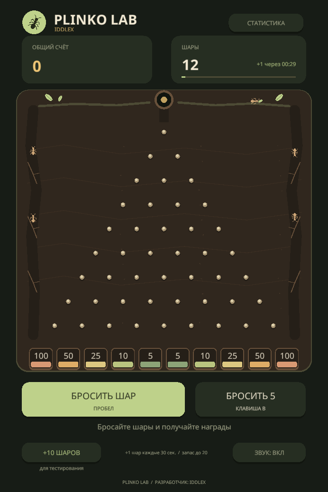

# Plinko Lab · HG Studio

**Разработчик: IDDLEX.**

Реализация [тестового задания Defold](https://hgstudio.notion.site/Defold-4236ab52e6804f6db582c60d2f59d387): настраиваемая игра Plinko с управляемой баллистикой, восстановлением запаса, сохранением незавершённых бросков и статистикой.

**Defold 1.13.1 · Lua 5.1 / LuaJIT · без сторонних runtime-зависимостей.**

Локальные сохранения рассчитаны на один процесс/вкладку на namespace. Внутри процесса второй владелец блокируется; перед записью проверяется актуальность файловой ревизии. Это не межпроцессный mutex. Для совместного доступа нужен соответствующий Repository хоста; границы описаны в [контракте](Docs/PERSISTENCE_CONTRACT.md#локальный-файловый-адаптер-один-писатель).

Муравьиная стилизация IDDLEX: земляная палитра, листья, муравьи по краям поля и эмблема автора. Название Plinko, шары, корзины, управление, награды и вероятности соответствуют исходной реализации ТЗ. Оформление не добавляет новых механик.



## Открыть проект

1. Откройте [game.project](game.project) в Defold 1.13.1 или совместимой новой версии.
2. Для запуска из редактора выберите **Project → Build** (`Ctrl+B`). Интернет для разрешения библиотек не нужен: проект не использует extensions или внешние Lua-пакеты.
3. Нажмите «Бросить шар», попробуйте серию и откройте статистику. Исходные параметры: 12 шаров, восстановление одного за 30 секунд до 20, серия из 5.

Логическое разрешение — 720×1080, начальное окно — 600×900. Пропорции сохраняются при изменении окна. Мышь и одиночное касание используют одну привязку ввода; дополнительно доступна клавиатура.

| Действие | Клавиша |
| --- | --- |
| Бросить один шар | `Space` |
| Бросить серию | `B` |
| Добавить шары для проверки | `G` |
| Открыть / закрыть статистику | `D` |
| Закрыть статистику | `Esc` |
| Включить / выключить звук | `M` |

## Что реализовано

- 10 корзин по умолчанию; 2–16 через конфиг, без ручной перестройки поля.
- Независимые веса и настраиваемые наборы наград: очки, шары, предметы; новые типы подключаются отдельными обработчиками. По умолчанию сохранены очки из ТЗ.
- Одиночный и атомарный групповой бросок без искусственного лимита активных шаров.
- Таймер восстановления, офлайн-начисление до cap, debug-выдача сверх cap.
- Постоянный счёт, попадания и проценты; требуемый render-вывод в debug и GUI-таблица в release.
- Версионированное сохранение в двух слотах, восстановление прежних исходов прерванных бросков, защита от повторного начисления.
- Русский интерфейс, адаптивное масштабирование, пул данных шаров и растущий mesh-буфер, подсветка кеглей/корзин, следы шаров и оригинальные звуковые эффекты.

Для произвольного распределения результат выбирается до запуска. Между кеглями действуют уравнения баллистики, направления импульсов при контактах согласованы с выбранной корзиной. Это собственная управляемая физика, без Box2D и столкновений шаров друг с другом. Расчёт и ограничения подробно описаны в [архитектуре](Docs/ARCHITECTURE.md).

## Архитектура и встраивание

Выбран **Passive View MVP**. `GamePresenter` зависит от `IGameService`, `IGameView` и `IFlightSimulation`; UI не обращается к Session или сохранениям. `LocalGameService` управляет локальными сценариями и доменом, получает `IClock` и `ISessionRepository`. Конфиг содержит только данные.

Источник сохранений отдельно заменяется через **options.Repository / ISessionRepository**: загрузка и запись могут завершаться сразу или позже. LocalGameService и игровую логику менять не нужно. Координатор обрабатывает ожидание, последовательные снимки, retry с прежним ID, версии и поздние callbacks; для подтверждённого закрытия есть Presenter.Flush. [Контракт и пример подключения](Docs/PERSISTENCE_CONTRACT.md).

Точка сборки — [scripts/bootstrap/plinko.lua](scripts/bootstrap/plinko.lua). Переданный `options.Service` заменяет локальную реализацию целиком, без создания локального RNG, часов и хранилища. Контракт допускает отложенные результаты, Busy, ошибки и восстановление; Presenter не считает возврат команды подтверждением. В production есть только локальный сервис, без сетевого транспорта или mock-сервера.

Для встраивания также доступны собственные View/Simulation, Config/RewardTypes, Repository/Clock, StorageNamespace и параметры Render. Хост передаёт lifecycle и ввод Presenter. Подробности, DTO и обязанности будущего backend — [SERVICE_CONTRACT.md](Docs/SERVICE_CONTRACT.md); устройство слоёв — [ARCHITECTURE.md](Docs/ARCHITECTURE.md).

## Настроить игру

Все игровые параметры находятся в [config/game.lua](config/game.lua). После изменения конфигурации перезапустите игру; hot reload параметров активной сессии не применяется.

| Параметр | Значение по умолчанию | Назначение |
| --- | --- | --- |
| `InitialBalls` | 12 | Запас новой сессии |
| `RefillCap` | 20 | Максимум автоматического восстановления |
| `RefillSeconds` | 30 | Интервал восстановления одного шара |
| `BatchSize` | 5 | Размер серии |
| `GrantSize` | 10 | Ручное начисление |
| `MaxInventory` | 1 000 000 | Жёсткая граница запаса, включая ручную выдачу |
| `Locale` | `ru` | `ru` или `en` |
| `Baskets` | 10 элементов | Стабильный `Id`, `Weight`, `Rewards`, `Color` каждой корзины |

Вероятность — вес корзины, делённый на сумму весов. Для равномерного распределения задайте всем вес 1. Для гарантированного попадания в одну корзину оставьте положительный вес только ей. Порядок элементов задаёт порядок слева направо. Не меняйте `Id`, если хотите сохранить историю этой корзины при перестановке или изменении награды.

### Настроить составную награду

У одной корзины можно заменить `Rewards` на:

```lua
Rewards = {
    {Type = "points", Amount = 100},
    {Type = "balls", Amount = 2},
    {Type = "item", ItemId = "leaf", Name = "Лист", Amount = 3},
},
```

Весь набор выдаётся одной транзакцией в памяти. При отказе любого обработчика ничего из набора не выдаётся частично: бросок остаётся в pending, приложение повторяет выдачу раз в секунду. Попадание учитывается сразу; статистика отдельно показывает число выданных пакетов. При заполненном запасе шаров нужно освободить место бросками. Ошибка обработчика также сохраняет право на награду, но требует исправления его кода.

Для нового вида наград добавьте handler и formatter, затем зарегистрируйте их в [config/reward_types.lua](config/reward_types.lua). `Session`, сохранения, доска и HUD не требуют веток под новый тип. Полный контракт и пример четвёртого типа — [REWARDS.md](Docs/REWARDS.md).

Используется новый формат сохранений **v3**, без миграции предыдущих данных по решению автора проекта. Старые файлы не читаются и не удаляются. Версии отдельных типов наград проверяются отдельно от версии snapshot.

### Как изменить количество корзин

Количество корзин равно числу записей в `Baskets`. Замените этот список, например, на три записи (остальные параметры оставьте):

```lua
Baskets = {
    { Id = "left",   Weight = 1, Rewards = {{Type = "points", Amount = 100}}, Color = "D89973" },
    { Id = "center", Weight = 1, Rewards = {{Type = "points", Amount = 10}},  Color = "B9C47F" },
    { Id = "right",  Weight = 2, Rewards = {{Type = "points", Amount = 50}},  Color = "8CA377" },
},
```

Получится три корзины с вероятностями 25%, 25% и 50%. Поддерживается 2–16 корзин; поле, траектории и статистика перестроятся при новом запуске. `Id` уникален, `Weight` — относительный вес, `Rewards` — список наград, `Color` — RGB без `#`. При правке существующей игры сохраняйте прежние ID там, где нужна прежняя история. Удалённые корзины уходят в архив статистики; оплаченные награды не теряются.

Лимита шаров **на поле** больше нет: `RefillCap` ограничивает только автовосстановление, `MaxInventory` — запас. Возможности устройства ограничивают реальную производительность. Геометрия и гравитация находятся отдельно в `scripts/simulation/board.lua`, палитра — в `scripts/ui/theme.lua`, параметры движка — в `game.project`.

Сохранённая игра имеет приоритет над `InitialBalls`. Путь слотов определяется `sys.get_save_file("PlinkoHG", "session-v3-a")` и `session-v3-b`; он зависит от платформы. Для чистой демонстрации закройте игру и **переместите оба слота в резервную папку**. Приложение не удаляет историю при запуске. Неизвестная версия, недоступность любого слота или отсутствие пригодного сохранения при повреждении данных блокируют перезапись и показывают диагностический экран.

## Навигация

| Путь | Ответственность |
| --- | --- |
| `scripts/contracts/` | Интерфейсы сервиса, View, симуляции, часов и repository |
| `scripts/application/` | LocalGameService, Game и SessionPersistence; без Defold API |
| `scripts/presentation/` | Passive View MVP Presenter, работающий только через порты |
| `scripts/bootstrap/` | Выбор конкретных реализаций и сборка экземпляра |
| `scripts/domain/` | Валидация, RNG, инвентарь, исходы и начисления |
| `scripts/simulation/` | Геометрия доски и баллистические маршруты |
| `scripts/infrastructure/` | Адаптеры repository, SaveStore и системных часов |
| `scripts/ui/` | Представление, эффекты и каталог строк |
| `main/` | Адаптер callbacks/ввода Defold, ресурсы и render pipeline |
| `tests/` | Спецификации логики и траекторий; `runtime/` — отдельная GUI-проверка в Defold |
| `tools/` | Запуск тестов без окон, статическая проверка и генерация звука |

- [Требования и соответствие ТЗ](Docs/REQUIREMENTS.md)
- [Контракт наград и добавление нового типа](Docs/REWARDS.md)
- [Архитектура и принятые решения](Docs/ARCHITECTURE.md)
- [Контракты сервисов, MVP и встраивание](Docs/SERVICE_CONTRACT.md)
- [Подмена источника сохранений: async repository и Flush](Docs/PERSISTENCE_CONTRACT.md)

## Проверки

Проверено на **Windows x64, Defold 1.13.1**:

- Production Windows x64 release собран; production WebGL debug/release собраны и запущены. Native Windows исполнялся в отдельном headless QA-bootstrap.
- **108/108 проверок** домена, сервисов, Presenter, хранилища, траекторий и renderer прошли.
- **4/4 интеграционных сценария** прошли в headless-движке: 2, 10, 16 и 3 корзины, по 1024 одновременно активных шара, рост mesh-буфера, настоящее сохранение/загрузка pending, награды и русская статистика; четвёртый сценарий проверяет составные награды и инвентарь предметов.
- **3/3 проверки файловых блокировок Windows** прошли: недоступность любого save-слота не перезаписывает прогресс; повторное открытие после восстановления доступа читает прежние данные.
- HTML5 debug и release проверены в изолированном Chrome/SwiftShader: ввод кнопками и клавишами, отмена клика, недостаточный запас, перезапуск с pending, сохранённые очки, статистика и три размера viewport. Отдельная копия текущего проекта проверяет составную награду 100 очков + 2 шара + 3 предмета с двумя перезапусками.
- Пиковый mesh после нагрузки уменьшается до 32 слотов; режим `-Profile` позволяет измерить стоимость Presenter/GUI/mesh/файлового адаптера на своей машине.
- Синтаксис 48 Lua-файлов, 17 ресурсов и 34 ссылки проверены без ошибок.

Headless-прогон проверяет работу кода с движком. WebGL-сценарии проверяют пиксели и ввод в изолированном браузере; замер полного кадра на целевом GPU и проверка звука выполняются отдельно.

Повторить тесты из корня проекта в Windows PowerShell 5.1 или PowerShell 7:

```powershell
# Только 108 тестов Lua; можно использовать lua/luajit из PATH.
.\tools\run-tests.ps1 -Lua '<путь к luajit-64.exe>'

# Дополнительно собрать и выполнить GUI-сценарии БЕЗ открытия окон.
.\tools\run-tests.ps1 -Lua '<путь к luajit-64.exe>' -DefoldJar '<Defold>\packages\defold-<revision>.jar'

# Тот же прогон с изолированным профилем CPU и файлового адаптера.
.\tools\run-tests.ps1 -Lua '<путь к luajit-64.exe>' -DefoldJar '<Defold>\packages\defold-<revision>.jar' -Profile
```

Для интеграции скрипт использует Bob из editor JAR и вариант движка `headless`. Java ищется рядом с JAR или задаётся через `-JavaPath`. Сборка и логи изолированы от обычного запуска: `build/qa-headless`, `bundles/qa-headless`, `.internal/qa-*.log`. Тестовые коллекции не читают и не записывают сохранения игрока. Дополнительная проверка хранилища использует build/qa-storage, bundles/qa-storage и уникальные .internal/storage-qa-<guid> с временными слотами. Ошибка процесса, Lua-ошибка, превышение времени или отсутствие маркера успешного завершения дают ненулевой код возврата.

Синтаксис без исполнения игры/тестов:

```powershell
powershell -File tools/check-syntax.ps1 -Lua <путь-к-luajit>
```

Те же спецификации можно запустить напрямую:

```text
luajit tests/domain_spec.lua
luajit tests/rewards_spec.lua
luajit tests/application_spec.lua
luajit tests/flight_spec.lua
luajit tests/mvp_spec.lua
luajit tests/storage_spec.lua
luajit tests/async_persistence_spec.lua
luajit tests/renderer_spec.lua
```

Они покрывают конфигурацию, распределение, таймеры, сохранения, прерванные броски, граничные значения, траектории, отложенные результаты сервиса, lifecycle Presenter и независимые экземпляры.

Границы слоёв проверяются отдельно: `powershell -File tools/check-layers.ps1`. Проверка импортов запрещает Presenter зависеть от реализации сервиса, а чистым слоям — обращаться к API движка или системным часам.

Для проверки готового HTML5 bundle установите Playwright и Pillow в локальное Python-окружение и укажите установленный Chrome:

```powershell
python tools/check-web.py --bundle '<bundle/PlinkoHG>' --chrome '<путь к chrome.exe>' --output .internal/web-check
```

Проверка использует временный браузерный контекст; логи и снимки сохраняются в игнорируемом каталоге `.internal/`.

## Ресурсы

Поле построено из векторных GUI-примитивов, шары рисуются собственным mesh-шейдером, без заимствованных игровых изображений. Noto Sans поставляется с [SIL OFL](assets/fonts/OFL.txt) и [сведениями об источнике](assets/fonts/README.md). Три PCM-эффекта созданы для проекта; воспроизводимая генерация — `python tools/generate_audio.py`.

Сборки, логи, локальные сохранения, настройки IDE и временные материалы исключены из Git. В репозитории находятся исходники игры, необходимые ресурсы, техническая документация и инструменты воспроизводимой проверки.
